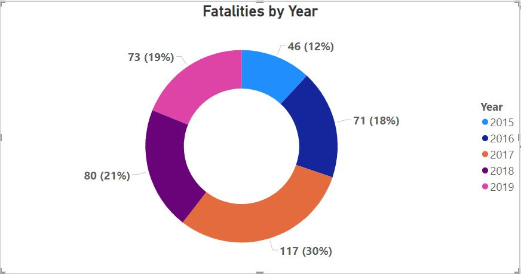

# Mass Shooting Analysis Project

## Introduction

The primary objective of this project is to analyze a mass shooting dataset using Microsoft Power BI. The dataset includes information about incidents involving multiple people being shot, with a focus on understanding patterns, trends, and correlations.

## Data Sources

The mass shooting datasets used in this analysis are collections of data related to incidents compiled by research organizations, government agencies, and journalists. The dataset includes information about the location, date, number of victims, weapons used, and other relevant details.

## Tasks Performed

### Data Cleaning and Transformation

1. **Remove Null Columns:**
   - In Power Query Editor, cleaned the data by removing null columns.

2. **Fill Empty Cells in "Prior Sign of Mental Health Issues" Column:**
   - Filled empty cells in the "Prior Sign of Mental Health Issues" column with "NA."

3. **Fill Empty Cells in "Mental Health Details" Column:**
   - Filled empty cells in the "Mental Health Details" column with "NA."

4. **Fill Empty Cells in "Weapon Obtained Legally" Column:**
   - Filled empty cells in the "Weapon Obtained Legally" column with "NO."

5. **Replace Empty Cells in "Latitude" Column:**
   - Replaced empty cells in the "Latitude" column with "38.6011101942605."

6. **Replace Empty Cells in "Longitude" Column:**
   - Replaced empty cells in the "Longitude" column with "-121.418965884654."

### Key Influencers Analysis

1. **Key Influencers Visual:**
   - Created a Key Influencers visual to analyze fatalities trends by the total number of victims with respect to total injured people.
   [- Key Influencers.JPG](https://github.com/psmadal1203/Mass-Shooting-Analysis-Project/blob/main/Key%20Influencers.JPG)
   

### Treemap Visualization

1. **Treemap Visualization:**
   - Created a treemap by categorizing cases with weapon details and the number of victims. Showed only deaths related to specific weapons.

### Waterfall Chart

1. **Waterfall Chart:**
   - Created a waterfall chart to display the race-wise number of victims per year. Filtered the data to show only Asian, Black, and Latino races.

### Donut Chart

1. **Donut Chart:**
   - Created a donut chart to show the number of fatalities for the years 2015, 2016, 2017, 2018, and 2019.

### Card Visuals

1. **Card Visuals:**
   - Created card visuals to display the total number of victims and the total number of injured people.

### Publish and Deploy

1. **Publish to Power BI Service:**
   - Published the report to the Power BI Service.

2. **Deployment Pipeline:**
   - Deployed the report in a deployment pipeline, including the development, testing, and production phases.

## Repository Structure

- **data/:** Contains the dataset file.
- **notebooks/:** Contains Jupyter notebooks or analysis scripts.
- **reports/:** Contains Power BI report files.
- **scripts/:** Contains scripts or Power BI files related to data cleaning and transformation.
- **visuals/:** Contains Power BI files related to various visualizations.

## Usage

1. Clone the repository.
2. Load the dataset into Power BI.
3. Open the Power BI report files in the "reports/" folder.
4. Explore and analyze the visualizations.

## Contact

For any questions or support, please contact us at support@intellipaat.com.

---

**© Copyright Intellipaat. All rights reserved.**
